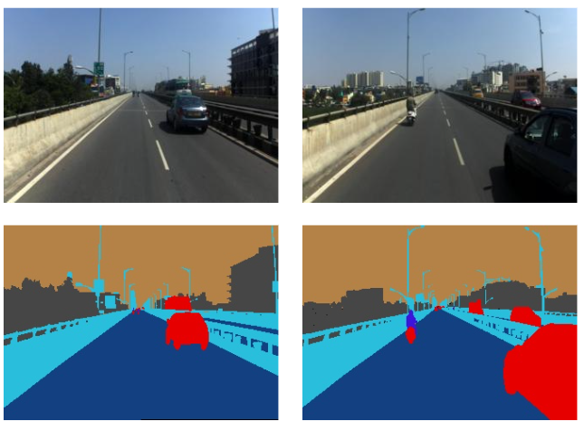
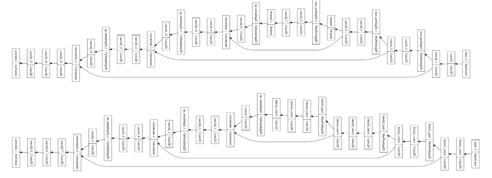
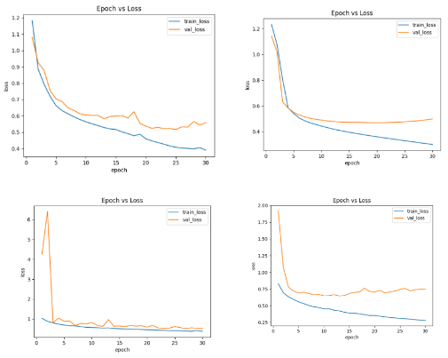
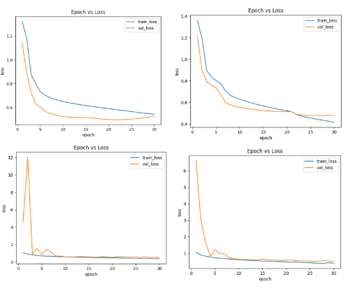
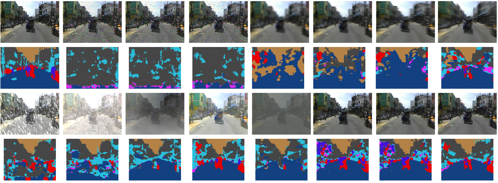
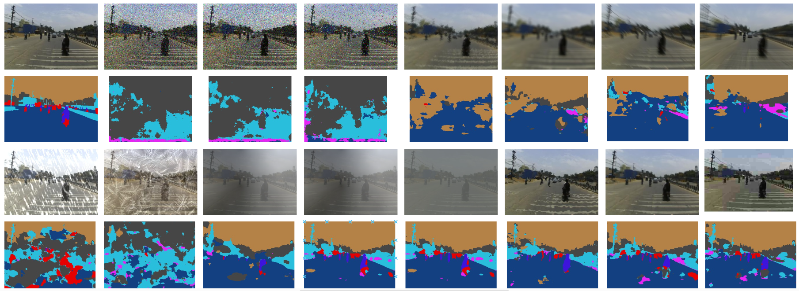

# Image_Seg
This project is a part of submissions to the CVIT task related to Image Segmentation.<br>
Report: [Task 1](https://drive.google.com/drive/folders/1tfWXMDAD7OLHQasNGLo6mglzh-izk4EP?usp=sharing) | [Task 2](https://drive.google.com/drive/folders/1tfWXMDAD7OLHQasNGLo6mglzh-izk4EP?usp=sharing) <br>
This code runs for both the tasks; task 1 which was to perform image segmentation on the given [Indian Driving Dataset Lite](https://idd.insaan.iiit.ac.in/evaluation/ncvgip19/) having 7 (+ 1) classes of Drivable, Non-Drivable, Living Things, Vehicles, Road Side Objects, Far Objects, Sky, and additional class Misc/ Non-Trainable (background) and task 2 which is a novel extension of task 1 in order to deal with out-of-distribution image segmentation using this dataset and [Image Corruptions Module](https://github.com/bethgelab/imagecorruptions.git). <br>
Please download the corruption module inside the given repo if you need to. 
<br>
<br>
We can train from scratch, evaluate pre-trained models, and visualize the segmentation labels for ground truth and predictions with respect to task 1 and task 2.
<br>
The image and the ground truth label can be seen as follows;<br>

<br>
The model architectures for UNet and Modified UNet can be seen;<br>

<br>
<br>
To train from scratch use the following command;
<br>
If we want to train the model with the consistency loss,
<br>
```bash
%cd path_to_ood_seg
python main_woc.py --data_path /path/to/dataset/ --aug none --bs 8 --lr 0.0001 --epochs 30 --model vgg_unet1
```
Also, if we want to train the model without the consistency loss,<br>
```bash
%cd path to ood_seg
python main_woc.py --data_path /content/drive/MyDrive/idd20k_lite/ --aug none --bs 8 --lr 0.0001 --epochs 30 --model vgg_unet1
```
To test the pre-trained models or the trained model one can use the following command;
<br>
For models trained with consistency loss,
```bash
%cd path to ood_seg
python evaluate_woc.py --data_path /content/drive/MyDrive/idd20k_lite/ --aug none --model vgg_unet1
```
Also, for models trained without consistency loss,<br>
```bash
%cd path to ood_seg
python evaluate_woc.py --data_path /content/drive/MyDrive/idd20k_lite/ --aug none --model vgg_unet1
```
To visualize the ground truth or the predictions one can use the following command;<br>
```bash
%cd path to ood_seg
python visualize.py --data_path /content/drive/MyDrive/idd20k_lite/ --aug none --corr 0 --is_pred 0 --img_num 0 --model vgg_segnet1 --is_woc 0 --is_plot_model 0 
```
# Qualitative Results
Here are a few plots of the loss functions;<br>
With respect to task 1 <br>
<br>
With respect to task 2<br>
<br>
<br>
Here are a few results visualizations<br>
With respect to task 1 <br>
<br>
With respect to task 2<br>
<br>
With respect to task 2<br>
<br>
<br>
Thus this repo is aimed as a part of submission to the CVIT tasks, where for the first task four basic segmentation models were used to perform image segmentation on the dataset. For the next task, two of the best models were chosen which was nothing but the first task's extension from an out-of-distribution point of view during the inference stage. <br>
